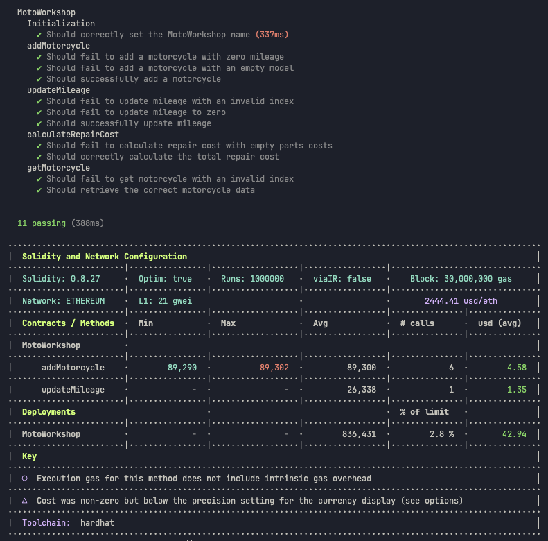

# Проект MyToken_Upgradeable_Factory

## Задание

Данный проект является результатом выполнения учебного задания по разработке и тестированию смарт-контрактов на Solidity с использованием фреймворка Hardhat. Основные этапы выполнения включали:
1. Написание контракта, использующего разные типы данных Solidity.
2. Оптимизация контракта для минимизации потребления газа.
3. Написание и запуск unit-тестов для проверки всех аспектов работы контракта.
4. Замер и анализ результатов тестов, включая использование газа и покрытие кода тестами.
5. Размещение кода в системе контроля версий для совместной разработки.

## Используемые технологии

- **Hardhat** — инструмент для разработки, тестирования и деплоя смарт-контрактов на Solidity.
- **@nomicfoundation/hardhat-toolbox-viem** — интеграция с Viem для работы с Ethereum через Hardhat.
- **dotenv** — управление переменными окружения для конфигурации.
- **eslint** — инструмент для анализа кода, помогающий поддерживать единый стиль кодирования.
- **prettier** — автоматическое форматирование кода для поддержания читаемости.
- **husky** — инструмент для автоматизации запуска Git хуков.
- **lint-staged** — запускает линтер только на измененных файлах перед коммитом.

## Описание проекта

Этот проект представляет собой смарт-контракт **MotoWorkshop** включает реализацию функций для работы с мотоциклами, таких как добавление, обновление пробега, расчет стоимости ремонта, а также получение информации о мотоцикле. Контракт демонстрирует работу с различными типами данных в Solidity (storage, memory, calldata, stack) и оптимизирован для минимизации потребления газа.

## Установка зависимостей

Для начала работы с проектом выполните установку всех необходимых зависимостей:

```shell
npm i --force    
```

## Переменные окружения

Для работы с проектом нужно создать файл `.env` в корневой папке проекта и добавить следующие переменные окружения:

```bash
INFURA_ID=
INFURA_SEPOLIA_URL=
INFURA_MAINNET_URL=
INFURA_BASE_URL=
PRIVATE_KEY=
TESTNET_MNEMONIC=
ETHERSCAN_API_KEY=
COINMARKETCAP_API_KEY=
```

Эти переменные используются для взаимодействия с сетью Ethereum, деплоя и верификации контрактов.

## Запуск задач проекта

Для выполнения задач и работы с проектом доступны следующие команды:

- Запуск всех тестов:
  ```shell
  npx hardhat test
  ```
- Запуск тестов с отчетом по использованию газа:
  ```shell
  REPORT_GAS=true npx hardhat test
  ```
- Запуск локальной сети для разработки:
  ```shell
  npx hardhat node
  ```

## Деплой контрактов

Запускаем Hardhat Network
```bash
npx hardhat node
```
### Деплой контракта на локальную сеть

Для запуска контракта в локальной сети выполните команду:

```bash
npx hardhat ignition deploy ignition/modules/MotoWorkshop.ts --network localhost
```

### Деплой контракта на Sepolia

Для деплоя контракта на тестовую сеть Sepolia:

```bash
npx hardhat ignition deploy ignition/modules/MotoWorkshop.ts --network sepolia
```

### Верификация контракта на Etherscan

После деплоя контракта на Sepolia, выполните команду верификации:

```bash
npx hardhat verify --network sepolia <contract-address> "MotoHub"
```

Где `<contract-address>` — это адрес вашего контракта.

## Линтинг и форматирование кода

Для поддержания качества кода и единого стиля в проекте используются следующие команды:

- Автоматическое исправление ошибок линтинга (ESLint):
  ```shell
  npm run lint:fix
  ```
- Форматирование кода (Prettier):
  ```shell
  npm run format
  ```

## Запуск тестов и проверка покрытия

Для запуска тестов с анализом покрытия выполните команду:

```bash
SOLIDITY_COVERAGE=true npx hardhat coverage
```

Эта команда покажет отчет о покрытии тестами, включая:
- % Stmts — количество покрытых выражений.
- % Branch — покрытие условий (if/else).
- % Funcs — покрытие функций.
- % Lines — покрытие строк кода.

<p align="center">
 
</p>

## Покрытие контрактов тестами

Контракты полностью покрыты тестами для следующих сценариев:
- **Инициализация контракта** — проверка правильности установки имени.
- **Добавление мотоциклов** — проверка корректности добавления и валидации данных.
- **Обновление пробега** — проверка обновления пробега и валидации индекса и новых данных.
- **Расчет стоимости ремонта** — проверка вычислений и обработки пустых данных.
- **Получение информации о мотоцикле** — проверка получения данных по индексу и обработки несуществующих индексов.

<p align="center">
 
</p>

## Оптимизация контракта

В контракте **MotoWorkshop** используется `calldata` для передачи неизменяемых данных, что помогает снизить затраты на газ. Валидация данных реализована с использованием `require`, что обеспечивает безопасность при выполнении операций. Оптимизация также затрагивает работу с переменными в памяти (`memory`) и стеке (`stack`).

