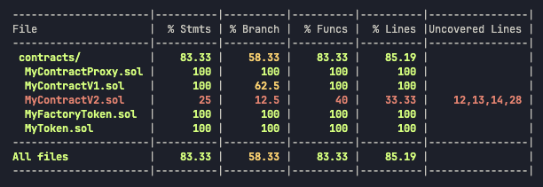
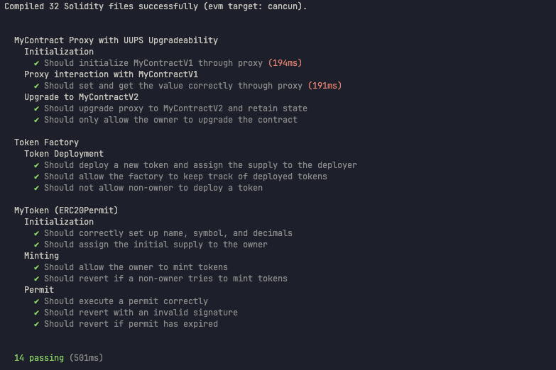
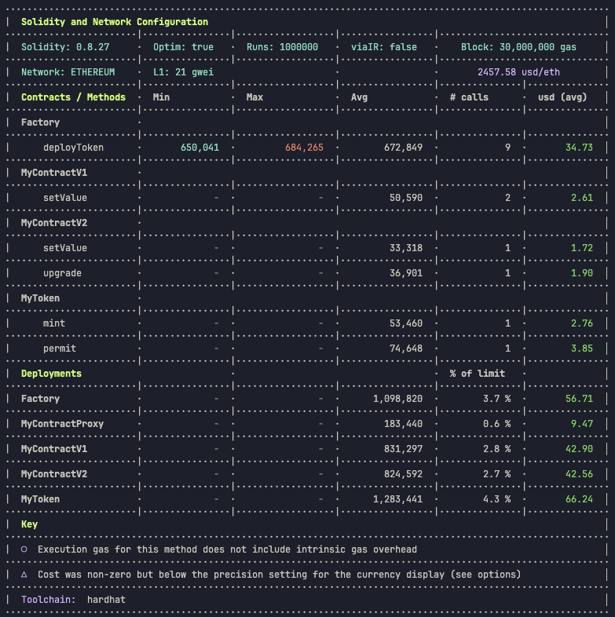

# Проект MyToken_Upgradeable_Factory

Этот проект демонстрирует разработку и тестирование смарт-контрактов на Solidity с использованием фреймворка Hardhat. Основной целью было создание обновляемого контракта с применением стандартов UUPS, а также разработка **Factory контракта**, который позволяет создавать новые экземпляры токенов.

## Задеплоенные контракты

### Локальная сеть

- **MyContractV1** - 0xB4AB39cc01c5c0773497c126e56D10F749E04FF9
- **MyContractV2** - 0xBaC9AB6392FEAa1E100e1A6E30c8eC3a43B2f117
- **MyContractProxy** - 0xD908A89a48Bc3bAC1b2320D68910E2E76e776a4e
- **Factory** - 0xB48899f900E01C6e0Bb740BD6F9435e1893A0c20

### Сеть Sepolia

- Контракты задеплоены аналогично локальной сети, указаны их адреса.

## Цель

Задание заключалось в следующем:

1. Создание обновляемого контракта с использованием стандартов:
   - Transparent Proxy
   - UUPS (используется в данном проекте)
   - Beacon
2. Написание **Factory контракта**, который создает новые токены с заданными параметрами.
3. Реализация системы контроля доступа для управления контрактами.
4. Добавление мета-транзакций в контракт и реализации стандарта ERC2612 (Permit).
5. Тестирование разработанных контрактов с использованием Hardhat и Viem.
6. Размещение кода в системе контроля версий (GitHub).

Ожидаемое время выполнения: около 14-16 часов.

## Используемые технологии

- **Hardhat** — фреймворк для разработки и тестирования смарт-контрактов.
- **Viem** — библиотека для взаимодействия с Ethereum, использующаяся вместе с Hardhat.
- **OpenZeppelin Contracts** — стандартные реализации контрактов для безопасной разработки.
- **Ignition** — инструмент для управления развертыванием контрактов в Hardhat.
- **dotenv** — для управления переменными окружения.
- **ESLint и Prettier** — инструменты для поддержки чистоты кода и единообразия стиля.

## Установка зависимостей

Для начала работы с проектом выполните установку всех необходимых зависимостей:

```shell
npm install
```

## Переменные окружения

Создайте файл `.env` в корневой папке проекта и добавьте следующие переменные:

```bash
INFURA_ID=
INFURA_SEPOLIA_URL=
INFURA_MAINNET_URL=
INFURA_BASE_URL=
PRIVATE_KEY=
TESTNET_MNEMONIC=
ETHERSCAN_API_KEY=
COINMARKETCAP_API_KEY=
```

Эти переменные используются для взаимодействия с сетью Ethereum и деплоя контрактов.

## Запуск задач проекта

Для выполнения задач доступны следующие команды:

- Запуск всех тестов:
  ```shell
  npx hardhat test
  ```
- Запуск тестов с отчетом по использованию газа:
  ```shell
  REPORT_GAS=true npx hardhat test
  ```
- Запуск локальной сети:
  ```shell
  npx hardhat node
  ```

## Деплой контрактов

### Локальная сеть

Для деплоя контрактов на локальной сети выполните команды:

```bash
npx hardhat ignition deploy ignition/modules/MyToken.ts --network localhost
npx hardhat ignition deploy ignition/modules/MyContractProxy.ts --network localhost
npx hardhat ignition deploy ignition/modules/MyFactoryToken.ts --network localhost
```

### Сеть Sepolia

Для деплоя контрактов на тестовую сеть Sepolia:

```bash
npx hardhat ignition deploy ignition/modules/MyFactoryToken.ts --network sepolia
```

### Верификация контракта на Etherscan

Для верификации контракта на Etherscan:

```bash
npx hardhat verify --network sepolia <contract-address>
```

Где `<contract-address>` — это адрес вашего контракта.

## Линтинг и форматирование

Для поддержания качества кода и единого стиля в проекте доступны команды:

- Автоматическое исправление ошибок линтинга:
  ```shell
  npm run lint:fix
  ```
- Форматирование кода:
  ```shell
  npm run format
  ```

## Запуск тестов и проверка покрытия

Для запуска тестов с анализом покрытия выполните команду:

```bash
SOLIDITY_COVERAGE=true npx hardhat coverage
```

Команда покажет отчет о покрытии тестами, включая:
- % выражений (Stmts)
- % условий (Branch)
- % функций (Funcs)
- % строк кода (Lines)

<p align="center">
 
</p>

## Покрытие контрактов тестами

Контракты покрыты тестами для следующих сценариев:

- **Инициализация контракта** — проверка корректности начальной установки значений.
- **Деплой токенов через Factory** — проверка развертывания новых токенов и их параметров.
- **Обновление логики прокси** — проверка возможности обновления логики прокси-контрактов до новой версии.
- **Контроль доступа** — проверка на невозможность выполнения определенных действий неавторизованными пользователями.

<p align="center">
 
</p>
<p align="center">
 
</p>

## Оптимизация контрактов

Контракты разработаны с учетом оптимизации использования газа. В контракте **Token** реализована функция `transfer` с учетом оптимизации затрат газа, а в **MyContractV1** и **MyContractV2** используется UUPS Upgradeable Proxy для обновляемости.
